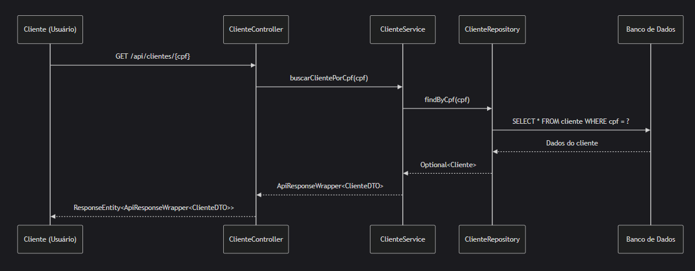
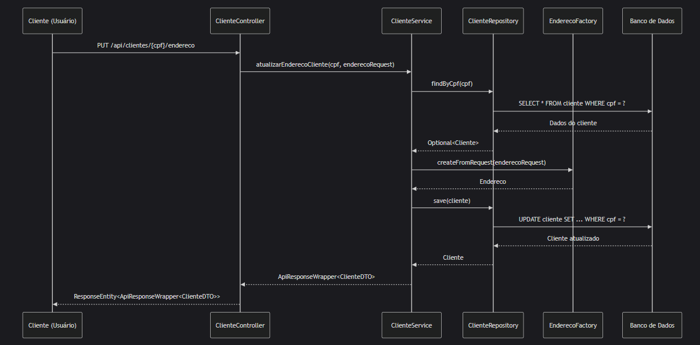
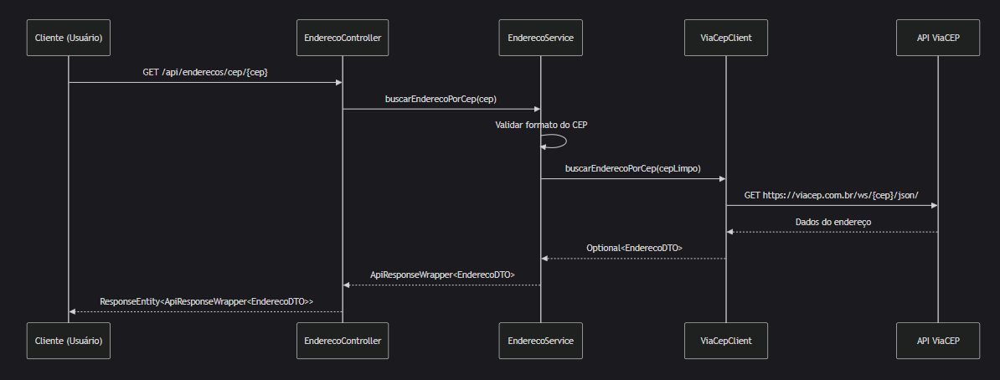
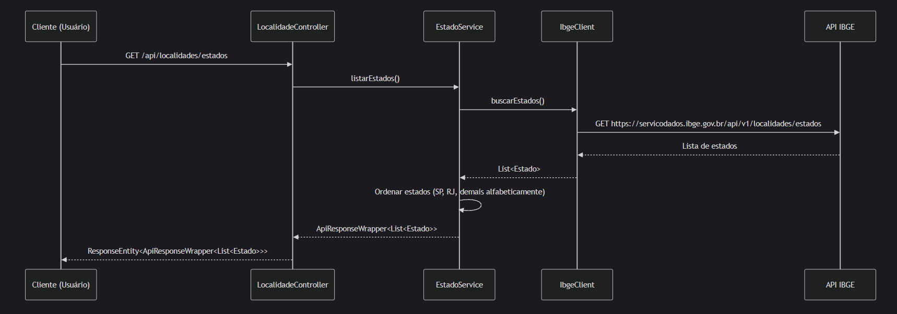
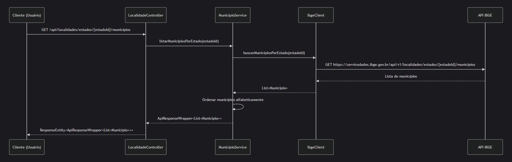

# API de Clientes

Este projeto implementa uma API RESTful para gerenciamento de dados cadastrais de clientes do Banco PAN, permitindo a consulta e atualização de informações como endereço.

## Tecnologias Utilizadas

- Java 21
- Spring Boot 3.4.5
- Spring Data JPA
- H2 Database (banco de dados em memória)
- Swagger/OpenAPI para documentação
- JUnit e Mockito para testes unitários
- Arquitetura Hexagonal

## Arquitetura

O projeto segue os princípios da Arquitetura Hexagonal (Ports and Adapters), separando a aplicação em camadas:

- **Domain**: Contém as entidades e objetos de valor do domínio
- **Application**: Contém os casos de uso e portas (interfaces) da aplicação
- **Infrastructure**: Contém os adaptadores para interagir com o mundo externo (banco de dados, APIs externas, etc.)

### Diagramas de Sequência

#### 1. Consultar Cliente por CPF




#### 2. Atualizar Endereço de Cliente



#### 3. Consultar Endereço por CEP



#### 4. Listar Estados



#### 5. Listar Municípios por Estado



## Funcionalidades

A API oferece as seguintes funcionalidades:

1. Consulta de dados cadastrais de cliente por CPF
2. Consulta de endereço por CEP (utilizando a API ViaCEP)
3. Consulta de estados brasileiros (com ordenação especial: SP primeiro, RJ segundo, demais em ordem alfabética)
4. Consulta de municípios por estado (utilizando a API do IBGE)
5. Atualização de endereço de cliente

## Endpoints da API

### Clientes

- `GET /api/clientes/{cpf}`: Consulta os dados cadastrais de um cliente pelo CPF
- `PUT /api/clientes/{cpf}/endereco`: Atualiza o endereço de um cliente

### Endereços

- `GET /api/enderecos/cep/{cep}`: Consulta um endereço pelo CEP

### Localidades

- `GET /api/localidades/estados`: Lista todos os estados brasileiros com ordenação especial
- `GET /api/localidades/estados/{estadoId}/municipios`: Lista todos os municípios de um estado

## Como Executar

### Pré-requisitos

- Java 21 ou superior
- Maven

### Passos

1. Clone o repositório
2. Navegue até a pasta do projeto
3. Execute o comando: `mvn spring-boot:run`
4. A aplicação estará disponível em: `http://localhost:8080`
5. A documentação Swagger estará disponível em: `http://localhost:8080/swagger-ui.html`
6. O console do H2 estará disponível em: `http://localhost:8080/h2-console`
   - JDBC URL: `jdbc:h2:mem:clientdb`
   - Usuário: `sa`
   - Senha: (vazio)

## Dados de Exemplo

A aplicação é inicializada com alguns clientes de exemplo:

1. **João da Silva**
   - CPF: 12345678901
   - Endereço: São Paulo/SP

2. **Maria Oliveira**
   - CPF: 98765432109
   - Endereço: Rio de Janeiro/RJ

3. **Carlos Pereira**
   - CPF: 45678912301
   - Endereço: Belo Horizonte/MG

## Testes

Para executar os testes unitários, utilize o comando:

```
mvn test
```

## Integração Contínua

Este projeto utiliza GitHub Actions para automação de CI/CD. O workflow é executado automaticamente em cada push para a branch `main` e em pull requests direcionadas à `main`.

O pipeline de CI inclui:

1. **Build e verificação**: Compila o código e executa todos os testes
2. **Verificação de vulnerabilidades**: Utiliza OWASP Dependency-Check para identificar vulnerabilidades conhecidas nas dependências
3. **Verificação de dependências desatualizadas**: Identifica dependências que possuem versões mais recentes disponíveis
4. **Armazenamento de artefatos**: O arquivo JAR gerado é armazenado como artefato da execução do workflow

Para visualizar os resultados das execuções do workflow, acesse a aba "Actions" no repositório GitHub.

## Documentação da API

A documentação completa da API está disponível através do Swagger UI:

```
http://localhost:8080/swagger-ui.html
```
